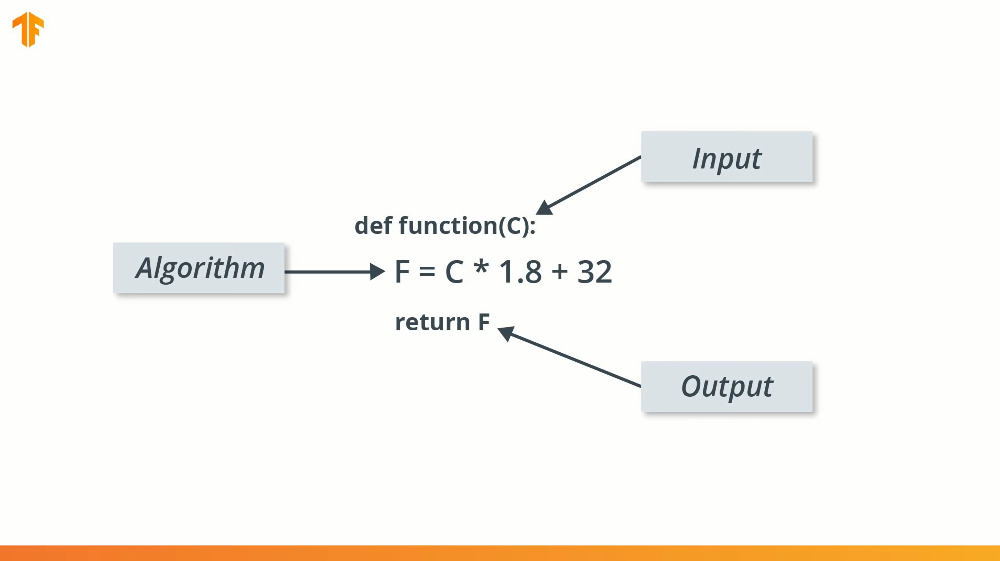

# Tensorflow

[TOC]


# 0. Tensorflow official guide - learn ML

**Master your path**

https://www.tensorflow.org/resources/learn-ml

* Basics of machine learning with TensorFlow

https://www.tensorflow.org/resources/learn-ml/basics-of-machine-learning 

* Theoretical and advanced machine learning with TensorFlow

https://www.tensorflow.org/resources/learn-ml/theoretical-and-advanced-machine-learning


# 1. Basics of machine learning with TensorFlow

Udacity: **Intro to TensorFlow for Deep Learning**

https://learn.udacity.com/courses/ud187


Course Notes:

## 1) Introduction to Machine Learning





https://learn.udacity.com/courses/ud187/lessons/7b590cdb-0acf-4118-848c-8728ced19bc6/concepts/946a3af2-4f06-4643-8115-f0ab760152a8

Reducing loss (from **Machine Learning Crash Course with TensorFlow APIs**)

https://developers.google.com/machine-learning/crash-course/reducing-loss/video-lecture

### Recap

Congratulations! You just trained your first machine learning model. We saw that by training the model with input data and the corresponding output, the model learned to multiply the input by 1.8 and then add 32 to get the correct result.


This was really impressive considering that we only needed a few lines code:

```python
l0 = tf.keras.layers.Dense(units=1, input_shape=[1]) 
model = tf.keras.Sequential([l0])
model.compile(loss='mean_squared_error', optimizer=tf.keras.optimizers.Adam(0.1))
history = model.fit(celsius_q, fahrenheit_a, epochs=500, verbose=False)
model.predict([100.0])
```

This example is the general plan for of any machine learning program. You will use the same structure to create and train your neural network, and use it to make predictions.

### The Training Process

The training process (happening in `model.fit(...)`) is really about tuning the internal variables of the networks to the best possible values, so that they can map the input to the output. This is achieved through an optimization process called Gradient Descent, which uses Numeric Analysis to find the best possible values to the internal variables of the model.

To do machine learning, you don't really need to understand these details. But for the curious: gradient descent iteratively adjusts parameters, nudging them in the correct direction a bit at a time until they reach the best values. In this case “best values” means that nudging them any more would make the model perform worse. The function that measures how good or bad the model is during each iteration is called the “loss function”, and the goal of each nudge is to “minimize the loss function.”

The training process starts with a forward pass, where the input data is fed to the neural network (see Fig.1). Then the model applies its internal math on the input and internal variables to predict an answer ("Model Predicts a Value" in Fig. 1).

In our example, the input was the degrees in Celsius, and the model predicted the corresponding degrees in Fahrenheit.


Figure 1. Forward Pass

Once a value is predicted, the difference between that predicted value and the correct value is calculated. This difference is called the loss, and it's a measure of how well the model performed the mapping task. The value of the loss is calculated using a loss function, which we specified with the loss parameter when calling `model.compile()`.

After the loss is calculated, the internal variables (weights and biases) of all the layers of the neural network are adjusted, so as to minimize this loss — that is, to make the output value closer to the correct value (see Fig. 2).


Figure 2. Backpropagation

This optimization process is called Gradient Descent. The specific algorithm used to calculate the new value of each internal variable is specified by the optimizer parameter when calling `model.compile(...)`. In this example we used the `Adam` optimizer.

It is not required for this course, but if you're interested in learning more details about how the training process works, you can look at the [lesson on reducing loss in Google’s machine learning crash course](https://developers.google.com/machine-learning/crash-course/reducing-loss/video-lecture).

By now you should know what the following terms are:

- **Feature:** The input(s) to our model
- **Examples:** An input/output pair used for training
- **Labels:** The output of the model
- **Layer:** A collection of nodes connected together within a neural network.
- **Model:** The representation of your neural network
- **Dense and Fully Connected (FC):** Each node in one layer is connected to each node in the previous layer.
- **Weights and biases:** The internal variables of model
- **Loss:** The discrepancy between the desired output and the actual output
- **MSE:** Mean squared error, a type of loss function that counts a small number of large discrepancies as worse than a large number of small ones.
- **Gradient Descent:** An algorithm that changes the internal variables a bit at a time to gradually reduce the loss function.
- **Optimizer:** A specific implementation of the gradient descent algorithm. (There are many algorithms for this. In this course we will only use the “Adam” Optimizer, which stands for *ADAptive with Momentum*. It is considered the best-practice optimizer.)
- **Learning rate:** The “step size” for loss improvement during gradient descent.
- **Batch:** The set of examples used during training of the neural network
- **Epoch:** A full pass over the entire training dataset
- **Forward pass:** The computation of output values from input
- **Backward pass (backpropagation):** The calculation of internal variable adjustments according to the optimizer algorithm, starting from the output layer and working back through each layer to the input.

### Dense


## 2) Your First Model - Fashion MNIST


